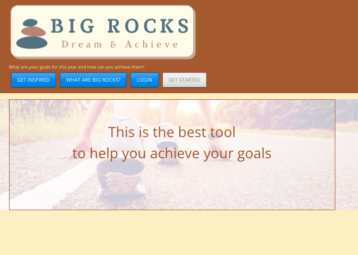
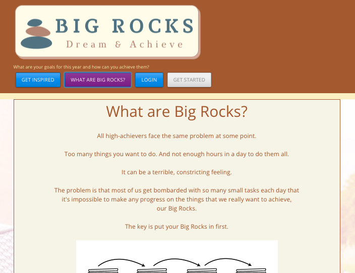
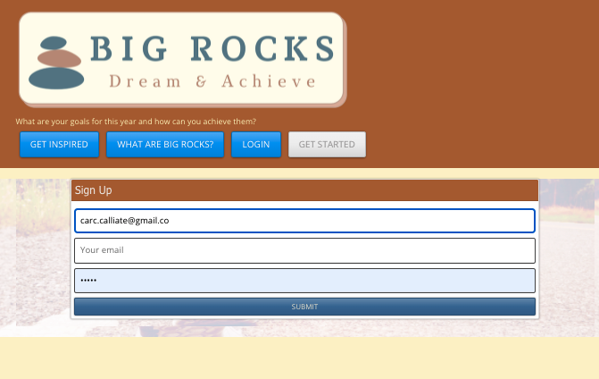
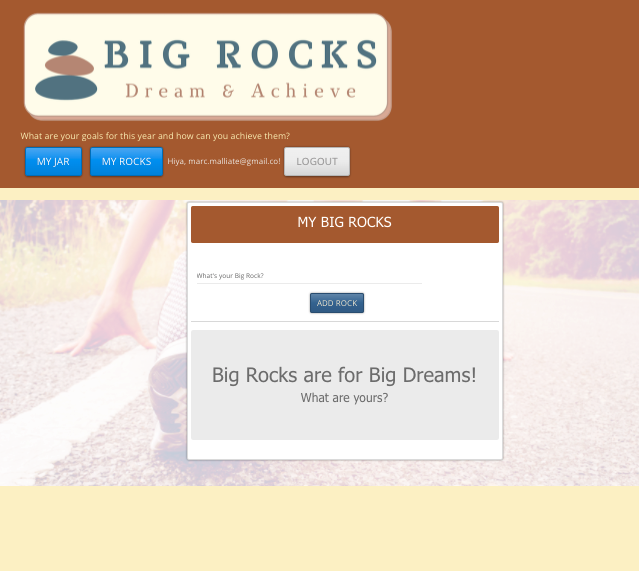
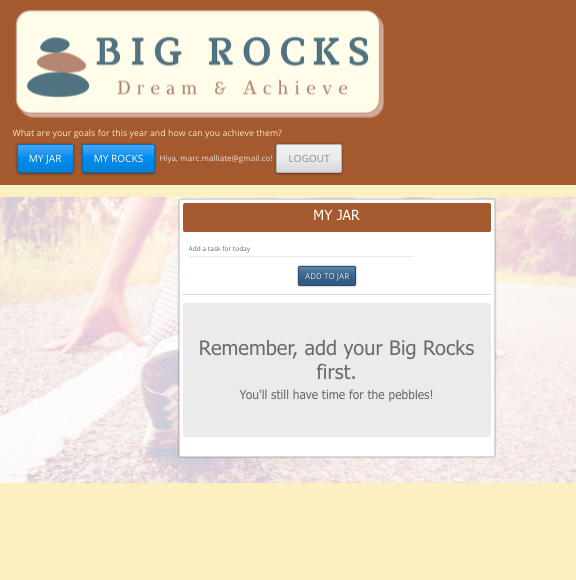
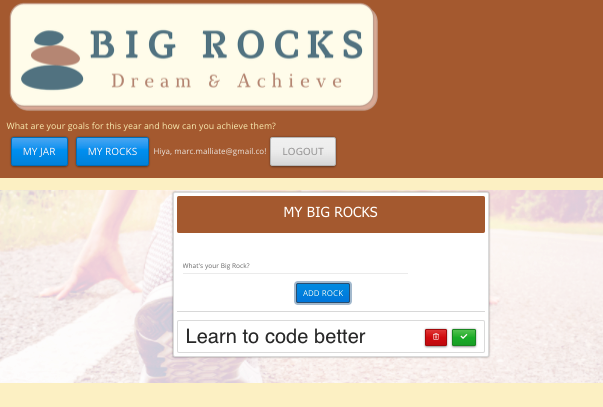
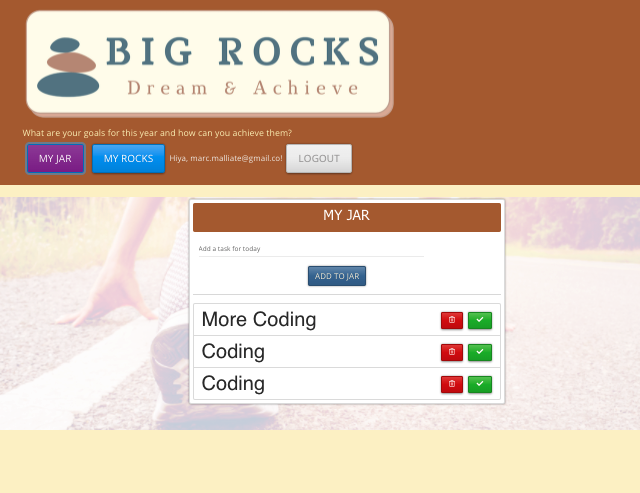

# Big-Rocks

---

## Table of Contents

1.  [Description](#Description)
2.  [Installation](#Installation)
3.  [Usage](#Usage)
4.  [License](#License)
5.  [Contributing](#Contributing)
6.  [Questions](#Questions)

 

## Description

Big Rocks is a full-stack MERN application meaning it used MongoDB, Express.js, REACT and Node.js. 
This app helps the user realise what their goals are and then helps them to plan their daily tasks with their goals in mind. 
Big Rocks has been deployed via Heroku. 

 

## Installation

Firstly, you must clone the code to your machine. 
Once the the code has been cloned, in the root folder open the command line and enter `npm install` This will install all dependencies that are required for the application to launch. 
 
Once this has complete, enter `npm run build` this will allow the application to build and finally enter `npm run develop` this will allow both the front end and back end server to run concurrently. 

  

## Usage

To use the app you may simply use the deployed link. 
https://big-rocks-dream-and-achieve.herokuapp.com/  
 
From here you can navigate through the website, learn about what your Big Rocks are. 
You may then sign up to create your Big Rocks and use the daily task manager. 

 

## License

This application has the following license:
[MIT License](https://opensource.org/licenses/MIT)

 

## Contributing

Please email me to discuss further.  
(https://github.com/marcmalliate)

 

## Questions

_If you would like to know more or have a question you'd like to ask, please contact me via email marc.malliate@gmail.com or you may also like to checkout my work [here](https://github.com/marcmalliate)_

 

### You may also like to view the GitHub repository which contains the code repository:

https://github.com/marcmalliate/Big-Rocks

 

### Screenshot of application:

Homepage:

What are big rocks?:

Sign up:

My Big Rocks:

 

My Jar:

 

Adding to My Rocks:

 
Adding to My Jar:

 

To view and test the deployed app visit : https://big-rocks-dream-and-achieve.herokuapp.com/

 

© _2021 Marc Malliate - Professional Readme Generator_
